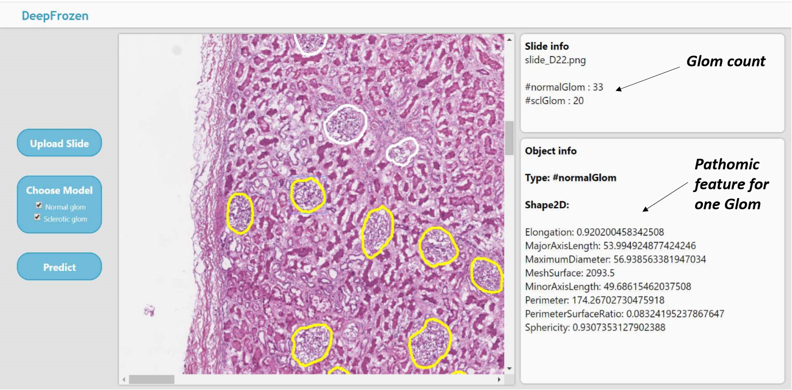

# flask-pytroch-cloud
This is a flask web app for an AI pathology application -- Deep learning Analysis of kidney frozen sections.

# Functions
For one whole slide image of kidney frozen section, you can:
- Choose which histology primitives to segment by pre-trained deep learning models
- Have an overview statistic report for this kidney biopsy slide 
- Click on one object detected and look at its detailed pathomic features 

# Tools
Flask - web framework  
fabric.js - canvas 
PyTorch - models 
pyradiomics - pathomic features 
(Nginx - cloud) 
(Gunicorn - cloud)

# Installation
#### create a new conda env: 
`conda create -n [name of enviroment] python=3.7`
#### install packages: 
`pip install -r requirements.txt`

# Run flask app on local computer
`cd flask-pytorch-cloud`     

`conda activate [name of enviroment]`       

`python app.py  ` 

Then open the url and upload the sample image `im0.png` to test the model.

# Deploy on a cloud server

   
